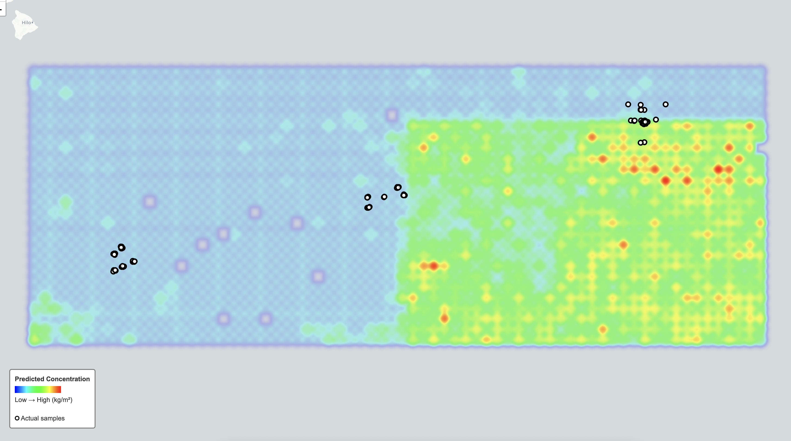

# Manganese Nodule Concentration Prediction

This repository contains a machine learning pipeline for predicting manganese nodule concentrations in the Pacific Ocean using bathymetry data and XGBoost regression.

## Overview

Manganese nodules are mineral deposits on the deep ocean floor that contain valuable rare earth elements. This project predicts nodule concentration (kg/m²) from seafloor bathymetry features using machine learning, based on historical survey data from the 1970s-1980s.

## Approach

The pipeline consists of six main steps:

### 1. Data Loading
- **Label Data**: Historical nodule concentration measurements from two sources:
  - Fewkes (1980): Deep-sea mineral deposits in the North Pacific
  - Piper et al. (1979): Manganese nodule distribution in the Pacific
- **Bathymetry Data**: GEBCO 2025 global bathymetry grid (15 arc-second resolution)
- **Data Processing**: Merge datasets, deduplicate overlapping locations, filter invalid values

### 2. Feature Engineering
Extract 13 bathymetry-derived features for each sample location:
- **Primary Features**: Depth, slope, roughness, aspect (sin/cos components)
- **Derived Features**: Depth squared, logarithmic depth, optimal depth zone indicator
- **Spatial Features**: Cyclical encoding of latitude/longitude (sin/cos)

### 3. Model Training
- **Algorithm**: XGBoost Regressor with regularization for small datasets
- **Cross-Validation**: Leave-One-Out CV (appropriate for small sample size ~30-40 samples)
- **Hyperparameters**: Tuned for small dataset (max_depth=4, min_child_weight=3, etc.)

### 4. Model Evaluation
- **Metrics**: RMSE, MAE, R² on LOO CV
- **Feature Importance**: Analysis of which bathymetry features contribute most to predictions

### 5. Visualization
- **Sample Map**: Interactive Folium map showing measured concentrations at survey locations
- **Prediction Map**: Heatmap of predicted concentrations over the study area (Pacific nodule province)

## Data Sources

### Label Data
- `labels/Fewkes_1980_2.tab`: Fewkes (1980) survey data
- `labels/Piper-etal_1979_tab8.tab`: Piper et al. (1979) survey data
- Combined dataset: ~35 unique locations after deduplication
- Concentration range: 0.5 - 26 kg/m²
- Geographic extent: 6°-17°N, 120°-155°W

### Bathymetry Data
- `bathy/gebco_2025_n20.0_s0.0_w-160.0_e-115.0.nc`: GEBCO 2025 subset
- Resolution: ~450m at equator
- Depth range: 3000-7000m in study area

## Dependencies

- Python 3.8+
- numpy, scipy, scikit-learn, xgboost
- polars (DataFrame processing)
- xarray, netCDF4 (bathymetry loading)
- folium (mapping)

Install with:
```bash
pip install numpy scipy scikit-learn xgboost polars xarray netcdf4 folium
```

## Usage

Run the complete pipeline:
```bash
python main.py
```

This will:
1. Load and process data
2. Train the model with LOO CV
3. Generate interactive maps
4. Save metrics and visualizations to `outputs/`

## Results

### Model Performance (LOO CV)
Based on typical runs:
- RMSE: ~4-6 kg/m²
- MAE: ~3-5 kg/m²  
- R²: 0.3-0.6

### Key Findings
- **Optimal Depth Zone**: Nodules concentrated at 4000-6000m depth
- **Top Features**: Depth, slope, and roughness are most predictive
- **Spatial Patterns**: Higher concentrations in certain topographic settings

### Outputs Generated
- `outputs/sample_locations.html`: Map of measurement locations with concentrations
- `outputs/predictions.html`: Predicted concentration heatmap
- `outputs/model_metrics.txt`: Detailed performance metrics and feature importance

### Visualizations



## Study Area

The Pacific nodule province spans the Clarion-Clipperton Fracture Zone, known for extensive manganese nodule deposits. The study focuses on a region with historical survey coverage and suitable water depths for nodule formation.

## References

- Fewkes, R. H. (1980). Manganese nodule deposits in the North Pacific. *Marine Mining*, 2(1), 1-20.
- Piper, D. Z., et al. (1979). The distribution of manganese nodules in the Pacific. *Marine Geology*, 32(1-2), 209-230.
- GEBCO 2025: https://www.gebco.net/
